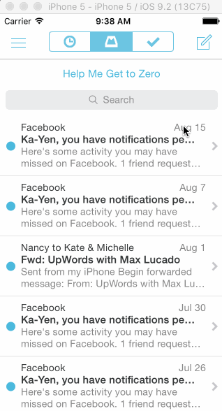

# Codepath Assignment #3

**Mailbox App** Code Path Assignment 3

Submitted by: **Jisi Guo**

Time spent: **10** hours spent in total

## User Stories

On dragging the message left...
Initially, the revealed background color should be gray.
As the reschedule icon is revealed, it should start semi-transparent and become fully opaque. If released at this point, the message should return to its initial position.
After 60 pts, the later icon should start moving with the translation and the background should change to yellow.
Upon release, the message should continue to reveal the yellow background. When the animation it complete, it should show the reschedule options.
After 260 pts, the icon should change to the list icon and the background color should change to brown.
Upon release, the message should continue to reveal the brown background. When the animation it complete, it should show the list options.
User can tap to dismissing the reschedule or list options. After the reschedule or list options are dismissed, you should see the message finish the hide animation.
On dragging the message right...
Initially, the revealed background color should be gray.
As the archive icon is revealed, it should start semi-transparent and become fully opaque. If released at this point, the message should return to its initial position.
After 60 pts, the archive icon should start moving with the translation and the background should change to green.
Upon release, the message should continue to reveal the green background. When the animation it complete, it should hide the message.
After 260 pts, the icon should change to the delete icon and the background color should change to red.
Upon release, the message should continue to reveal the red background. When the animation it complete, it should hide the message.
Optional: Panning from the edge should reveal the menu
Optional: If the menu is being revealed when the user lifts their finger, it should continue revealing.
Optional: If the menu is being hidden when the user lifts their finger, it should continue hiding.

## Video Walkthrough 

Here's a walkthrough of implemented user stories:

GIF created with [LiceCap](http://www.cockos.com/licecap/).

## Notes

Describe any challenges encountered while building the app.

## License

    Copyright [yyyy] [name of copyright owner]

    Licensed under the Apache License, Version 2.0 (the "License");
    you may not use this file except in compliance with the License.
    You may obtain a copy of the License at

        http://www.apache.org/licenses/LICENSE-2.0

    Unless required by applicable law or agreed to in writing, software
    distributed under the License is distributed on an "AS IS" BASIS,
    WITHOUT WARRANTIES OR CONDITIONS OF ANY KIND, either express or implied.
    See the License for the specific language governing permissions and
    limitations under the License.
